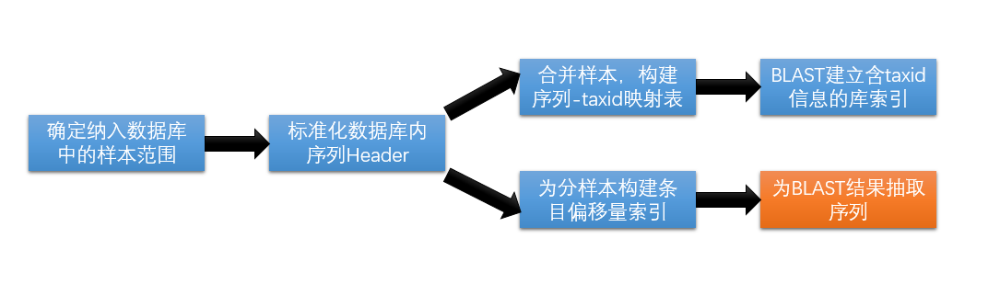

# OneKP/NCBI Merge


## 0. 概述

​	本项目为对CNGBdb中的OneKP数据进行整理，并整合入部分NCBI的植物CDS、Protein数据作为补充，并以为后续物种鉴定及多序列比对用BLAST开发提供测试和应用数据。针对OneKP数据，其官方维护的[网页](https://wiki.cyverse.org/wiki/display/iptol/Sample+names+to+be+changed)中提到了目前数据库中存在一些有待整理的内容，在本项目中也一并考虑并进行订正，最终形成一个命名方式统一的、可用性更高的数据库。


## 1. 数据构成

- OneKP-Project:  1,462个Nucl样本数据库 + 1422个Protein样本数据库
  - 实际使用数据：1304个Nucl样本数据库 + 1283个Protein样本数据库
- NCBI: 引入([Soltis D E, et al. 2018](https://bsapubs.onlinelibrary.wiley.com/doi/full/10.1002/ajb2.1071))中与OneKP-ID有对应关系的样本数据


## 2. Header格式

#### OneKP-Data

```
# CDS
>gnl|onekp|cds_[4chars'ONEKP_ID]-[Seq_ID]-[taxid]

# Prot 
>gnl|onekp|prot_[4chars'ONEKP_ID]-[Seq_ID]-[taxid]
```

#### NCBI-data

```
# CDS
>lcl|[NC_ID]_cds_[NP_ID]-[taxid] { [annotation1] ... }

# Prot
>lcl|[NC_ID]_prot_[NP_ID]-[taxid] { [annotation1] ... }
```


## 3. OneKP中的数据待整理项

### 	

### 3.1 OneKP样本中存在的特殊样本

- **combined 样本**

  - 以`-A,-B`等为后缀的多样本pooling（可能存在弃用数据）
  - 同一物种的不同样本测序pooling（OneKP物种映射表中区分为不同物种）

  多样本中可能存在弃用数据(3.2.3)

- **未确定物种样本**


### 3.2 OneKP样本中数据错误、样本杂乱的问题，需要进行数据清洗整理

- **3.2.1 存在样本污染或其他原因导致的一个样本数据中含有两个以上的物种信息**

  |      | Current Best Name | Name Used in Files       | Comment                                                      |
  | :--: | ----------------- | ------------------------ | ------------------------------------------------------------ |
  | NWQC | mixed species     | Plagiochila_asplenioides | Plagiochila asplenioides and Fissidens   adianthoides found in voucher |
  | CHJJ | Frullania spp.    | Lejeuneaceae_sp.         | mixed: Frullania inflata (majority) and some   F. Eboracensis found in voucher |
  |      | ...               | ...                      | ...                                                          |


- **3.2.2 基于对序列数据的观察而进行了重分类的样本**

  |      | Current Best Name  | Name Used in Files      | Comments                                  |
  | ---- | ------------------ | ----------------------- | ----------------------------------------- |
  | BMJR | Adiantum raddianum | Adiantum_tenerum        | revised from chloroplast marker sequences |
  | JQFK | Picochlorum atomus | Nannochloropsis_oculata | synonym confusion in original name        |
  |      | ...                | ...                     | ...                                       |

  

- **3.2.3 重新装配错误数据导致的数据弃用**

  OneKP中有部分数据被检测出assembly错误后进行了重新重新装配，仅有seq-id在3000000-3999999范围内的数据可用。

  |      | Species Name           | Additional Description |
  | ---- | ---------------------- | ---------------------- |
  | GDUD | Chloromonas reticulata | B                      |
  | FMRU | Zygnema sp.            | 2 samples combined     |
  |      | ...                    | ...                    |

  

- **3.2.4 未确认原因的重命名 (Please contact Eric Carpenter if you know what happened)**

  |      | Current Best Name       | Name Used in Files    | Comments |
  | ---- | ----------------------- | --------------------- | -------- |
  | LNER | Casuarina equisetifolia | Casuarina_glauca      |          |
  | IOVS | Pseudotsuga wilsoniana  | Pseudotsuga_menziesii |          |
  | ZXJO | Parahemionitis arifolia | Hemionitis_arifolia   |          |

  

- **3.2.5 同义物种命名词替换**

  |      | Current Best Name              | Name Used in Files         | Comments |
  | ---- | ------------------------------ | -------------------------- | -------- |
  | DCDT | Gaga arizonica                 | Cheilanthes_arizonica      |          |
  | LSLA | Euphorbia mesembryanthemifolia | Chamaseyce_mesebyranthemum |          |
  |      | ...                            | ...                        | ...      |

  

- **3.2.6 数据提供者进行命名替换**

  |      | Current Best Name       | Name Used in Files    | Comments |
  | ---- | ----------------------- | --------------------- | -------- |
  | WTJG | Ophioglossum petiolatum | Ophioglossum_vulgatum |          |
  | ZQYU | Phlebodium pseudoaureum | Polypodium_plectolens |          |
  |      | ...                     | ...                   | ...      |

  

- **3.2.7 Sample names中出现了细微变动**

  |      | Current Best Name   | Name Used in Files  | Comments |
  | ---- | ------------------- | ------------------- | -------- |
  | NWMY | Kadsura heteroclita | Kadsura_heteroclite |          |
  | HUGU | Boerhavia dominii   | Boerhavia_dominnii  |          |
  |      | ...                 | ...                 | ...      |

  

## 4. 数据处理流程

​	

- 为合并数据构建taxid映射表目的是在BLAST建库时能映射序列到其对应物种的信息，实现搜索范围的限制功能（未确定：不能确定物种的样本如何标注？暂定弃用）

- 为分样本建立索引：每个分样本具有序列-偏移量索引表，提高后续多序列比对时寻找Target对应序列的速度（曾进行pickle二进制压缩存储的方案，速度较慢，暂定以json模式存储）

- BLAST比对产生结果的`output-format`可以进行一定程度的定制，可进行评估确认是否足以满足后续多序列比对所需信息的需求，则有可能减省建索引的步骤。定制命令规格如下例：

  ```shell
  blastn -db $DB -query $QUERY -out $OUTFILE -outfmt "6 qseq sseq"
  ```

  

## 5. 数据整合工具

- **python 3.7** 
  - BeautifulSoup4
  - requests
  - html5lib
- **perl 5.22**
- **shell-scripts**


## 6. 遗留问题及注意点

- 最终进度为将Merge后的Nucl/Prot更换为最终规范的命名并建立Blast索引完成，但是每个分样本仍为中间版本的命名法，需进行修正（在`Doc/scripts/CorrectTemp`中保有修正脚本）
- 有些在本次清洗中忽略的数据或许是可以使用的，可以与数据库负责人进一步沟通确定后再引入
  -    OneKP: combined 样本
  -    OneKP: Rawdata 样本目录名中带有如`Oenothera_laciniata`这样含有多个疑似同物种的样本，但因特殊原因【不明】区分了物种名
  -    Unknown样本，不能确定taxid的样本...

- 爬取表格的过程是在Windows环境下进行的，因此提取数据时注意将行末尾`\r`进行处理

## 7. 路径说明

```txt
# 主目录： /hwfssz1/BIGDATA_COMPUTING/liwenhui/1.Etools/1.SAtools/OneKP/MergeDB

./
|___ Merge-NUCL	// 完成建库的Merge-Nucl-FASTA
|___ Merge-PROT // 完成建库的Merge-Prot-FASTA
|___ NuclDB		// ONEKP样本FASTA及加入的NCBI的FASTA独立文件，‘ProtDB’同
|___ ProtDB
|___ Doc		// 说明文档及workflow脚本
	  |
	  |___ GetSpecies_Taxid 				// 爬虫脚本、OneKP数据问题完整表格
	  |___ [NCBI/ONEKP]_Final_Use_List.csv  // 最终使用的样本物种列表
	  |___ scripts						    // workflow脚本
	  		 |__ ...
	  		 |__ Log
	  		 |__ OldVersion_scripts			// 部分弃用的老版本脚本
	  		 |__ CorrectTemp				// 实际建库时进行debug留下的脚本
```

