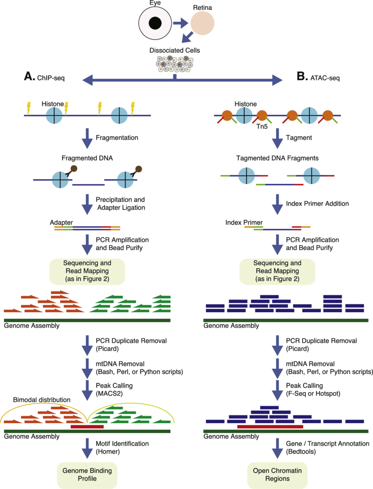
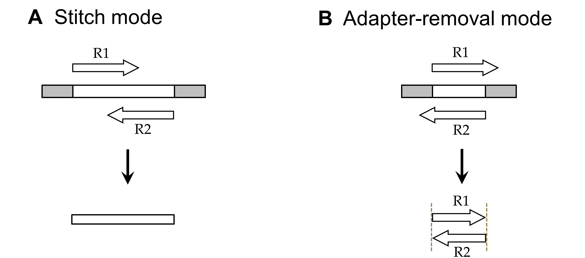

# ATAC-seq Data Analysis Workflow



## Data Gathering
* The ATAC-seq data used in this worklow is a subset of the analysis:[NCBI](https://www.ncbi.nlm.nih.gov/pmc/articles/PMC5042844/).
* The ref-genome is HG19.

## SRA to FASTQ
* As the raw data are SRA format, we need to transform them to FASTQ format that we can do reads-mapping. We use fastq-dump to do this:
```
fastq-dump --split-3 -O $OUTPATH $INPUTDATA

--split-3 : for Pair-End Sequening data, fastq-dump will divide the SRA file into 2 FASTQ files.

```

## Sequence Quality Control
* We need to do Quality-Control for the sequence data, including checking the sequence-score, trimming the adapters.(Sometimes we need to 'cut off' the low-quality reads.)

* Tools: FastQC+NGmerge / fastp

* Remove Adapters




## Read Mapping

* Use Bowtie2 for reads-mapping.

```
Build Index:
    bowtie2-build $REFPATH/hg19.fa

Reads Mapping:
    bowtie2 -X 1000 -p 20 -x $REFPATH/hg19.fa \
                    -1 $INPUTPATH/${sra}_noadapters_1.fastp -2 $INPUTPATH/${sra}_noadapters_2.fastp \
                    -S $BAMDIR/${sra}.sam
    # bowtie2 para:
    # -X: set max-value for ISIZE
    # -p: threads number
    # -x: ref-genome file(index-built)
    # -1/-2: PE fastp files
    # -S: output file : .sam
```

## Markdup/Map quality Control