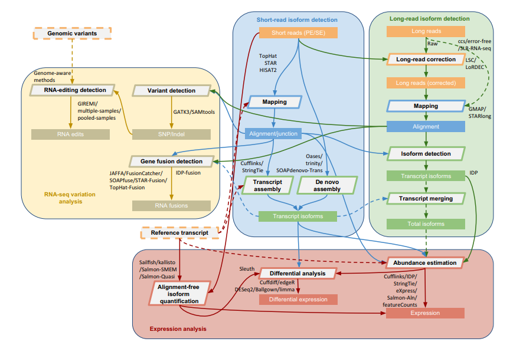

# RNA-seq Data Analysis Workflow



## Data Gathering
* The RNA-seq data used in this worklow is a subset of the analysis:[NCBI](https://www.ncbi.nlm.nih.gov/pmc/articles/PMC5042844/).
* The ref-genome is GRCh37(including FASTA and GTF files).

## SRA to FASTQ
* See [ATAC-seq-README](https://github.com/Bocabbage/Bioinfo-sh/blob/master/atac_seq/README.md)

## Sequence Quality Control

* Use [FastQC](https://www.bioinformatics.babraham.ac.uk/projects/fastqc/) for quality-control.
* Without removing the adapters, we found that the STAR(reads-mapping software used in this workflow) can map all the reads to the ref. So we skip this step. You can use the following command to check it with [samtools](https://github.com/samtools/samtools) installed:
```
    samtools flagstat <in.bam>
```

## Reads Mapping

* Although Bowtie2 can be used in RNA-seq mapping, we use the more popular [STAR](https://github.com/alexdobin/STAR)

```
Build Index:
STAR --runThreadN 6 --runMode genomeGenerate \
     --genomeDir /mnt/work/lihm/GRCH_37/ \
     --genomeFastaFiles /mnt/work/lihm/GRCH_37/GRCh37.primary_assembly.genome.fa \
     --sjdbGTFfile /mnt/work/lihm/GRCH_37/gencode.v30lift37.annotation.gtf \
     --sjdbOverhang 100

Reads Mapping:
STAR --runThreadN 20 --genomeDir /mnt/work/lihm/GRCH_37 \
         --readFilesIn ${INPUTPATH}/${sra}_1.fastq ${INPUTPATH}/${sra}_2.fastq \
         --outSAMtype BAM SortedByCoordinate \
         --outFileNamePrefix ${BAMDIR}/$sra
```

## Transcript Assembly

* In order to get gene-expression data,we need to do transcript-assembly to get transcript data from mapping-reads.
* Tools:[StringTie](https://ccb.jhu.edu/software/stringtie/)

## Compute Counts

* RNA-seq data uses the concept 'counts' to quantify genes expression.
* Tools:[HTseq](https://htseq.readthedocs.io/en/release_0.11.1/)

